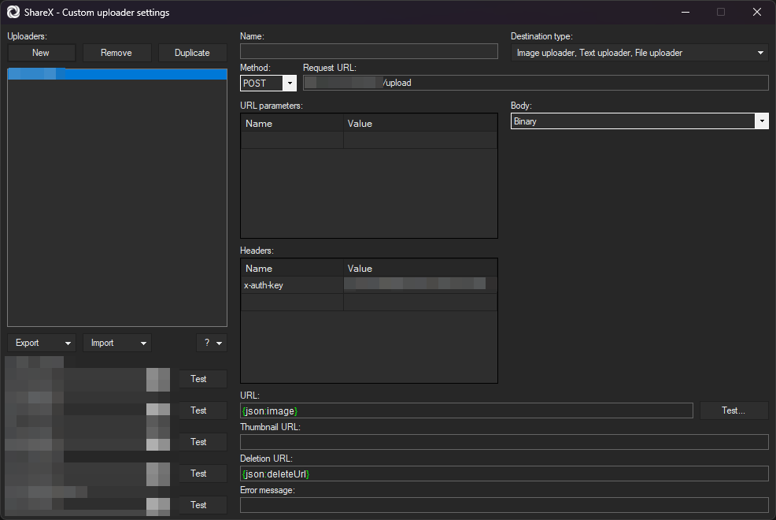

# ShareX R2 Cloudflare

## Worker and R2 Setup

- Ensure you have wrangler installed and configured. See [here](https://developers.cloudflare.com/workers/get-started/guide/) for more details
- Clone repo (or fork?), and run `npm ci` to install dependencies
- Choose a bucket name to use in the next steps. For the purpose of this example, I'll be using `sharex-files`
- Edit `wrangler.toml` with your `account_id`, `route`, and `r2_buckets.bucket_name`
- Run `wrangler r2 bucket create <bucket name>`
- Generate a random string of characters - this will be used for an `AUTH_KEY` header that we'll send along with ShareX
	- This ensures that only you can upload to your script
- In your GitHub repository, create an `AUTH_KEY` secret, and set its value to the `AUTH_KEY` you just generated
	- This will be used by the GitHub Action to deploy the worker
- In your GitHub repository, create a `CF_API_TOKEN` secret, and set its value to a Cloudflare API token with the following permissions:
	- Account - Workers KV Storage - Edit
	- Account - Workers R2 Storage - Edit
	- Account - Cloudflare Pages - Edit
	- Account - Workers Builds Configuration - Edit
	- Account - Workers Scripts - Edit
	- Account - Workers Tail - Read
	- Account - Workers KV Storage - Edit
	- Account - Account Settings - Read
	- User - Memberships - Read
	- User - User Details - Read
	- Zone - Workers Routes - Edit

	- Then be sure to give it access to the application account/zone resources you want to use

- If using GitHub Actions (like this repo), simply push your changes and the worker will be automatically deployed - see your Actions log for any errors.
- (optional) If you want to deploy manually, or use some other CI other than GitHub Actions, you will need to manually setup the `AUTH_KEY` secret (via the Workers UI, or `wrangler secret put`), and then run `npm run deploy`.

## ShareX Setup

For full documentation on ShareX custom uploaders, please review their documentation at https://getsharex.com/docs/custom-uploader.

- Open Main Window -> Destinations -> Custom Uploader Settings
- New -> Name it `R2` or whatever else you want
- Set the `Destination Type` to `Image uploadere`
- Set the `Method` to `POST`
- Set the `Request URL` to the URL of your worker, with `/upload` appended, such as `https://cdn.4w3.dev/upload`
- Set the `Body` to `Binary`
- Leave URL paramaters blank
- (optional) Add a new URL paramater called `filename`, and set it to `{filename}`. If this is set, the original filename will be used when storing to R2, otherwise a random ID will be generated
- Add a new header under `Headers` called `x-auth-key`, and set it to the secure string you generated earlier
- Set `URL` to `{json:image}`
- Set `Deletion URL` to `{json:deleteUrl}`
- Use the testers on the left hand side to test your configuration
- When ready, change your default destination for images (etc.) to `R2`

## Acknowledgements

https://github.com/kotx/render is used to retrieve files from R2, since this is a fantastic example handling ranges, etags, HEAD requests, and more. Huge shoutout to [kotx](https://github.com/kotx) for this work!
